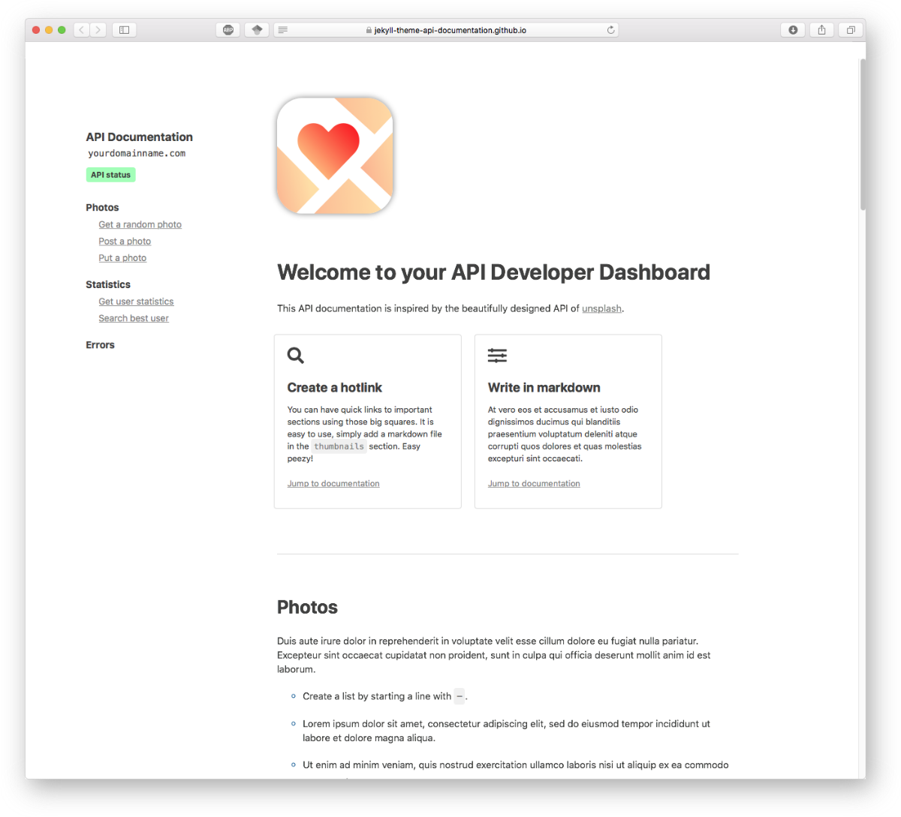

# Jekyll flat API

A Jekyll theme for API documentation. It is inspired by the beautifully designed API of <a href="https://unsplash.com/documentation">unsplash</a>. 

 


## Usage

Simply run

```
jekyll server
```

If something goes wrong, follow the instruction from [jekyll](https://jekyllrb.com/docs/themes/).


## Creating content

The content of the API is located in `_documentation`. You can create as many folders as you want to organize your API. In each subfolder of `_documentation`, you may find markdown files. 

### Jekyll tags

Files with `front: true` in their header will be presented higher as leaders of sections in the navigation bar. Those leaders can be ordered using the `order: ` tag in the markdown file. For example, `_documentation/photos/photos.md` is the leader of the photo section. 

It is very important that the files with `front: false` have a permalink such that it contains the permalink of its section leader. 

### Image

The top image and the main title are located in `_includes/home.html`. 

### Navbar

The API status url in the navbar can be modified in `_includes/nav.html`

### Thumbnails

At the top of the page, you may find small squares. You can create them using the tag `thumbnail: true` in the mardown files. 

## Style

If you want to modify the style, have a look at `_sass/layout.scss`. At the top, you will find variables that control the most of the colors.
